Link of the frontend of this projrect: https://github.com/Reece-Lu/propertymanagement-graduationproject which is a Vue project.

Link of the interface description(Swagger): http://3.96.64.25:9091/swagger-ui/index.html#/

The address of this project: http://3.96.64.25

# Abstract

The title of this graduation design is the design and implementation of a smart property management system in the post-epidemic era. With the impact of the epidemic as the background, property has now become the caretaker and leader of the community, and the residents' lives strongly rely on the services provided by property management as a basic guarantee.

This system's development aims to address the issues of uneven work division and outdated management tools within property management companies, while enhancing the ability of property management to respond to the new needs of residents. To solve these problems, the design and implementation of this system required features such as reasonable design, adaptability to market demand, and low cost for secondary development.

The implementation technology of this system is based on SpringBoot and Vue, with additional computer technologies including MySQL, Element UI, Swagger, Nginx, as well as internet products such as ECS cloud servers and SMS text messaging. It is a front-end and back-end separated project that incorporates functionalities such as repair and maintenance, pet management, isolation logistics, community broadcasting, vehicle management, decoration management, and verification code checking.

The system has been implemented using software engineering methods and has undergone stages including feasibility analysis, requirements analysis, general design, detailed design, testing, and deployment. It has successfully achieved a closed-loop functionality, reliability, and independent operation as a property management system.

The system can be accessed at [HTTP://COMMUNITYMANAGEMENT.TECH](HTTP://COMMUNITYMANAGEMENT.TECH).

**Keywords: Property Management System, SpringBoot, Vue**

# **Table of Contents**

[ABSTRACT](#_toc105336629)

[Table of Contents	III](#_toc105336630)

[1	Introduction	1](#_toc105336631)

[1.1	Project Development Background	1](#_toc105336632)

[1.1.1	Analysis of Pain Points for Communities without Property Management Systems	1](#_toc105336633)

[1.1.2	Analysis of Pain Points for Existing Property Management Systems	2](#_toc105336634)

[1.2	Main Work and Contributions	2](#_toc105336635)

[1.3	Paper Structure and Organization	3](#_toc105336636)

[2	Feasibility Analysis	4](#_toc105336637)

[2.1	Market Feasibility	4](#_toc105336638)

[2.2	Economic Feasibility	5](#_toc105336639)

[2.3	Technical Feasibility	5](#_toc105336640)

[2.4	Social Feasibility	5](#_toc105336641)

[3	Requirements Analysis	6](#_toc105336642)

[3.1	System Top-level Requirements Structure	6](#_toc105336643)

[3.2	System Functional Module Requirements Analysis	6](#_toc105336644)

[4	Overall Design of the System	11](#_toc105336645)

[4.1	Introduction to Development Technologies	11](#_toc105336646)

[4.2	System Architecture Diagram	13](#_toc105336647)

[4.2.1	Logical Architecture of the System	13](#_toc105336648)

[4.2.2	Physical Architecture of the System	13](#_toc105336649)

[4.3	System Flowchart Analysis	14](#_toc105336650)

[4.4	Database Design (ER Diagram and Relation Table Design)	16](#_toc105336651)

[4.4.1	Repair and Maintenance Module and Parcel Collection Module	16](#_toc105336652)

[4.4.2	Pet Management Module	19](#_toc105336653)

[4.4.3	Vehicle Management, Decoration Management, and Community Broadcasting Modules	21](#_toc105336654)

[5	Detailed Design and Implementation of the System	23](#_toc105336655)

[5.1	Architecture Design Solution	23](#_toc105336656)

[5.2	Pagination Query Algorithm	24](#_toc105336657)

[5.3	Fuzzy Search	24](#_toc105336658)

[5.4	Route Guard Design	24](#_toc105336659)

[5.5	SMS Verification	25](#_toc105336660)

[6	Main Functionality Implementation of the System	28](#_toc105336661)

[6.1	Login Function	28](#_toc105336662)

[6.2	Proprietor Registration Function	29](#_toc105336663)

[6.3	Proprietor Personal Information Modification Function	30](#_toc105336664)

[6.4	Repair and Maintenance Function	30](#_toc105336665)

[6.5	Parcel Collection Function	32](#_toc105336666)

[6.6	Community Broadcasting Function	34](#_toc105336667)

[6.7	Pet Management Function	35](#_toc105336668)

[6.8	Vehicle Management Function	36](#_toc105336669)

[6.9	Decoration Management Function	37](#_toc105336670)

[7	System Testing and Deployment	39](#_toc105336671)

[7.1	System Testing	39](#_toc105336672)

[7.1.1	Interface Testing	39](#_toc105336673)

[7.1.2	Performance Testing	40](#_toc105336674)

[7.2	System Deployment	42](#_toc105336675)

[7.2.1	Deployment Design	42](#_toc105336676)

[7.2.2	Domain Name Registration	43](#_toc105336677)

[7.2.3	System Filing	44](#_toc105336678)

[8	Summary and Outlook	46](#_toc105336679)

[8.1	Summary	46](#_toc105336680)

[8.2	Outlook	46](#_toc105336681)

# **Introduction**
## **Project Development Background**
### **Analysis of Pain Points for Communities without Property Management Systems**
**Analysis of Property Management Pain Points:**

The purpose of property management companies is to generate profit, aiming to maximize their profits [1]. There are two ways for companies to increase profits: expanding revenue sources and reducing operational costs.

In terms of revenue sources, property management income includes media resource operations, venue resource operations, operational properties, and other businesses [2]. However, for property management industry, no matter how much industry expands, the number of consumers, i.e., residents in communities, remains relatively fixed, making it difficult to increase profits by expanding revenue sources.

Cost control is an important issue that property management companies need to address as they belong to the service industry. In terms of cost control, the analysis of problems faced by property management companies includes the following three points:

**1. Uneven Division of Work, Inability to Fully Utilize Employees' Value**

Some property management companies face challenges in cost management and control due to unreasonable job positions that fail to effectively restrain employees [2]. Unclear division of responsibilities and chaotic work tasks within the company result from various demands encountered while serving the residents. Without clear delineation of responsibilities, property management operations lack standardization and have uneven workloads, leading to inefficient utilization of employees' value and cost wastage.

**2. Outdated Property Management Tools, Inefficiency in Property Management Personnel**

Traditional property management models still influence property companies, resulting in decreased efficiency and quality of cost management due to the lack of modern cost management tools [3]. Traditional property management methods are no longer suitable in the current era of interconnectedness. A preliminary survey reveals that in communities without property management systems, residents and property management personnel rely on platforms like WeChat for online communication. Residents privately message property management for personal demands, such as reporting heating maintenance and equipment repairs. Property management uses group chats to collect information, such as bulk requests for supplies or checking residents' health codes. Community announcements are made through group notifications, including notifications about property fee payments and regulations.

Although such methods achieve the desired results, they are inefficient and require unnecessary investment from both property management and residents. Additionally, property personnel using WeChat for work purposes is unprofessional, blurring the lines between work and personal life and hindering accurate assessment of workloads.

**3. New Needs and Issues in the Context of the Epidemic**

Considering the relationship between epidemic prevention and interpersonal communication, property management personnel now have more frequent contact with residents in their daily lives [4]. The current pandemic situation has forced many residents to work and isolate at home, leading to an exponential increase in the number of residents requiring property services. Furthermore, as many residents are restricted in their activities, property management companies need to assist them in maintaining their daily lives. Traditional management methods have resulted in an overwhelming workload for property management companies, while residents do not receive satisfactory services.

**Analysis of Residents' Pain Points:**

Without an independent management platform, communities are limited in the types of services that property can provide, leaving residents dissatisfied and not recognizing the value of property services. This discrepancy arises from the misalignment between the cost of property and its value [5]. Especially in the current epidemic context, where residents are working and isolating at home, the services provided by property are crucial in maintaining their daily lives. Residents require a property management company with strong execution capabilities and high efficiency.

### **Analysis of Pain Points for Existing Property Management Systems**
**1. Inability of Existing Systems to Meet New Requirements**

Existing property management systems often struggle to quickly adapt to new requirements from residents. To handle new demands, residents and property management personnel resort to using tools like WeChat for communication. Over time, the concept of community management has been evolving. The recent epidemic outbreak not only highlights the importance of property management but also makes them the caretakers and leaders of communities [6]. The work-from-home and home-isolation lifestyle has generated numerous new requirements, necessitating feature-rich and well-designed property management systems in communities.

Moreover, property management companies can only establish a better property management brand and gain public recognition by improving their service consciousness, transforming their development approach, and pursuing innovative development [7]. Property management companies need excellent management tools to ensure work efficiency and enhance their competitiveness.

**2. High Costs of Secondary System Development**

Secondary development of management systems typically involves object model construction, business scenario customization, and workflow encapsulation [8]. If the need for secondary development is not considered during the initial design of the property management system, the system architecture becomes fixed, making upgrades and optimizations complex. Property management companies and outsourcing companies may need to invest more financial and material resources than the original development cost to upgrade the system. Property management systems need to have the characteristic of low secondary development costs, which is a crucial consideration for property companies when choosing a management system.

## **Main Work and Contributions**
This graduation design first analyzes the key issues that need to be addressed by the property management system, compares it with existing property management systems, and then uses software engineering methods for design and development. The implementation steps include feasibility analysis, requirements analysis, general and detailed design, testing, and deployment.

In the feasibility analysis phase, this graduation design analyzes the existing property management systems in the market, identifies pain points for different roles within this management system, determines the key functions that the smart property management system needs to implement, and identifies its core competitive advantages. Next, an economic feasibility analysis is conducted to estimate the development, operation, and upgrade costs of the system and further analyze the economic benefits it can bring to users. Then, based on the existing property management systems, the required technology stack is determined to derive the optimal development plan. Finally, a social feasibility analysis is performed to assess the impact of this property management system on society.

In the requirements analysis phase, business requirements that need to be implemented are analyzed from the perspectives of different users, and use case diagrams for each role are provided. In the overall design phase, the identified development tasks are divided, and the E-R diagram and database design plan for the system are presented. The detailed design phase involves the development and implementation based on the requirements analysis, accompanied by concurrent unit testing. After completing the detailed design, the system is subjected to interface testing, stress testing, and other tests to verify its security, reliability, and robustness. Finally, the system is deployed, the website is filed, and a domain name is registered.

## **Structure and Organization of the Thesis**
Except for the first chapter, the structure of this thesis is as follows:

In Chapter 2, the feasibility analysis of the graduation design topic is conducted, with a focus on discussing the value of the smart property management system, including market feasibility, technical feasibility, economic feasibility, and social feasibility [9].

In Chapter 3, the requirements analysis for the smart property management system is presented, dividing the system's functionalities and providing functional diagrams and lists.

In Chapter 4, the overall design of the system is presented, analyzing the functional modules identified in the requirements analysis and providing a preliminary design plan, including specific function parameters, the flow of business activities, and the database design plan.

In Chapter 5, the detailed implementation steps of the smart property management system are showcased, including the detailed design methods employed.

Chapter 6 describes and demonstrates the core functionalities implemented in this management system.

Chapter 7 describes the system testing results, including interface testing and stress testing, and verifies the system's security, reliability, and robustness using black-box and white-box methods. The chapter also introduces the system's deployment, including server settings and configurations, domain name registration, and filing.

Chapter 8 summarizes the smart property management system and discusses future development possibilities.

# **Feasibility Analysis**
## **Market Feasibility**
In today's domestic communities, intelligent access control systems are commonly equipped. Access control system technology has matured, and well-known manufacturers producing community access control systems include Schneider, ADT LLC, Nortek Control, SALTO, and Honeywell, among others. Facial recognition access control systems are gradually becoming popular in information management, and facial recognition technology is also being applied in various AI scenarios [10]. Based on the level of development, the access control system market is relatively saturated and is in a phase of innovative transformation.

On the other hand, community service management systems, which are complementary products, are not commonly seen. As shown in Figure 2.1.1, based on preliminary surveys conducted during the requirements analysis phase, almost the majority of communities do not have a property management system that addresses the demands of residents. In the market, this type of property management system is currently in high demand.

**Figure 2.1 Survey Results for Property Management System Deployment**

Implementing a property management system that addresses the demands of residents will effectively solve the communication issues between residents and property management personnel.

## **Economic Feasibility**
The economic feasibility of this system is characterized by:

1. Since the property management system does not have high concurrent characteristics or complex calculations, the hardware requirements for system operation are relatively low. Therefore, significant investment in hardware configuration is not required.
2. The property management system will be developed using a frontend-backend separation approach. Compared to traditional development methods, this design approach facilitates the addition of new features in the future and updates to existing features. These advantages can save on system operation and maintenance costs.
3. After introducing this management system, property management companies can improve employee work efficiency, reducing the overall labor requirements and costs and increasing company revenue.

## **Technical Feasibility**
The technical feasibility of this system is characterized by:

4. The system will be developed using a frontend-backend separation approach. The frontend will utilize Vue.js, while the backend will employ the popular Spring Boot framework. The data will be stored in a MySQL database, capturing entity information and relationships [11]. This combination is mature and widely used.
5. Leading internet companies in China provide convenient system deployment tools, such as Alibaba Cloud and Tencent Cloud series of products. These tools significantly reduce the difficulty of development and deployment.

## **Social Feasibility**
Social feasibility involves analyzing related intellectual property rights, social influence, and other issues. In this property management system, there are no software patent ownership issues, no infringement issues, and no conflicts with national policies and regulations. It actively responds to the "Internet+" policy and assists in the upgrading and transformation of traditional industries.

# **Requirements Analysis**
## **Top-level System Requirements**
This property management system consists of seven modules: Account Management, Community Repair & Maintenance, Isolation Logistics Services, Renovation Management, Vehicle Statistics, Community Broadcasting, and Pet Management. Figure 3.1.1 depicts the top-level design structure of this system.

**Figure 3.1 Function Module Diagram**

As shown in Figure 3.1, the Account Management module includes registration and login functionalities for both residents and property management personnel. In the registration function for residents, detailed residential information is required, including building number, unit number, family role, and title. In the property management registration, detailed work information for property management personnel is required, including but not limited to employee ID, WeChat ID, email, and position. The module also provides functionality for modifying personal information, allowing users to edit their account details. Property management personnel have the authority to query information for all residents.

## **System Function Module Requirements Analysis**
Account Management module: As shown in Figure 3.2, the Account Management module serves as the foundation of the entire system. There are two types of users: residents and property management personnel. In the Account Management module, both residents and property management personnel can register, log in, and modify their personal information. In the registration function for residents, detailed residence information is collected, including building number, unit number, family role, and title. In the property management registration, detailed work information for property management personnel is collected, including but not limited to employee ID, WeChat ID, email, and position. The module also provides functionality for modifying personal information, allowing users to re-edit their account details. Property management personnel have the authority to query information for all residents.

**Figure 3.2 Account Management Module Use Case Diagram**

Community Repair & Maintenance module: As shown in Figure 3.3, the Repair & Maintenance module is the core functionality of the smart property management system. It enables residents to submit repair requests, providing essential information such as the repair location and time, which is stored in the system. After residents submit a repair request, property management personnel will receive a repair list. Property management personnel can edit the status of repair events based on the actual situation. Residents can track the status of their repair requests in real-time.

**Figure 3.3 Repair & Maintenance Module Use Case Diagram**

Pet Management module: As shown in Figure 3.4, the Pet Management module primarily deals with the statistics of pets in the community and provides pet boarding services. Residents can add and modify pet information in the system, and property management personnel have the ability to view the pet information in the community. The property management system also provides pet boarding services, allowing residents to apply for boarding and providing necessary information such as boarding time and pet food type for property management personnel to review.

**Figure 3.4 Pet Management Module Use Case Diagram**

Isolation Logistics Services module: As shown in Figure 3.5, isolation logistics is a new requirement for property management systems in the context of epidemics. The initial version of this system provides the service of proxying express deliveries for residents in isolation. In the system, residents can create requests for proxying express deliveries and enter relevant information such as the delivery location, pickup code, and courier company. Property management personnel can view the requests and provide corresponding services to residents. They can also edit the delivery status in the system, which residents can check.

**Figure 3.5 Isolation Logistics Services Module Use Case Diagram**

Renovation Management module: As shown in Figure 3.6, the Renovation Management module aims to collect renovation information within the community, facilitating the management of personnel entering and exiting for renovation purposes and helping property management understand the key areas that require maintenance in the community. Residents can register their renovation information in the system, including construction team names, construction times, contact information, etc. Property management can query the renovation plans within the community and manage the entry and exit of construction teams through the system.

**Figure 3.6 Renovation Management Module Use Case Diagram**

Vehicle Management module: As shown in Figure 3.7, the property management system keeps track of residents' vehicles. Residents can register their vehicle information and parking space details in the system. Property management can use the collected data to obtain information about vehicle parking within the community.

**Figure 3.7 Vehicle Management Module Use Case Diagram**

Community Broadcasting module: As shown in Figure 3.8, property management personnel use the community broadcasting feature to send notifications to residents. Property management can edit and modify the published notifications. Residents can view the latest community announcements in the system.

**Figure 3.8 Community Broadcasting Module Use Case Diagram**

# **Overall System Design**
## **Introduction to Development Technologies**
This chapter provides a detailed introduction to the development tools used in the smart property management system. The relevant tools are shown in the following table (Table 4.1.1):

**Table 4.1 Development Tools Table**

|**No.**|**Tool Name**|**Configuration or Version**|**Purpose**|
| :-: | :-: | :-: | :-: |
|**1**|Intel i5-1038NG7 16G|macOS Monterey 12.3|Development Device|
|**2**|Alibaba Cloud 1 core 2 GiB|CentOS 7.8|Deployment Device|
|**3**|Tencent Cloud 2 cores 4GB|CentOS 7.6.1|Code Hosting|
|**4**|MySQL|5.7.28|Database|
|**5**|Java|1.8.0|Backend Development Language|
|**6**|Spring Boot|2.5.9|Backend Framework|
|**7**|MyBatis|2.2.1|Database Tool|
|**8**|Lombok|\|Development Plugin|
|**9**|Swagger|3.0.0|API Management|
|**10**|Vue|2.0|Frontend Framework|
|**11**|Element UI|For Vue 2.X|Component Library|
|**12**|Vant UI|For Vue 2.X|Component Library|
|**13**|Axios|\|API Implementation|
|**14**|Java (Deployment)|1.8.0_291|Deployment Environment|
|**15**|MySQL (Deployment)|5.7.36|Deployment Environment|
|**16**|Docker|20.10.14|Deployment Environment|
|**17**|Nginx|1.21.6|Deployment Environment|
|**18**|GitLab|Community Edition 10.0.0|Code Hosting|
|**19**|Python|3.8.5|Test Data Generation|
|**20**|Navicat|16.0.9|Database Management|
|**21**|Intellij IDEA|2021.3.2|Backend Development|
|**22**|Webstorm|2021.3|Frontend Development|
|**23**|PyCharm|2021.3|Test Data Generation|
|**23**|PyCharm|2021.3|Test Data Generation|
|**24**|Postman|9.14.0|API Testing|
|**25**|Termius|7.28.0|Server Connection|
|**26**|Google Chrome|100.0.4896.127|Testing|
|**27**|Safari|15.4|Testing|
|**28**|LoadImpact|\|Load Testing|
|**29**|Tencent Domain|\|Domain Name|
|**30**|Tencent Cloud SMS|\|SMS Verification Code|

The main development of this property management system was done on an Intel i5 16G configured computer. Navicat tool was used for database development, Intellij IDEA for backend development, and Webstorm for frontend development. Postman was used for some API testing. After development, the project was deployed on an Alibaba Cloud shared cloud server with a configuration of 1 core and 2GB of memory. The project's iterative code management was stored on a Tencent Cloud shared server with a configuration of 2 cores and 4GB of memory.

MySQL was used for database development, and MyBatis was used as the database tool to implement CRUD operations between the backend project and the database. The backend development was done using the Spring Boot framework, with additional development plugins such as Lombok. The Swagger tool was configured for API testing, with Postman used as an auxiliary tool. The frontend development was done using the Vue 2.0 framework, with Axios used for API communication, and Element UI and Vant component libraries used for page design, corresponding to the property management and resident sides, respectively.

The project was deployed using Docker and Nginx. Docker was responsible for running the backend, and Nginx was responsible for frontend operations. Finally, a domain name www.communitymanagement.tech was registered on Tencent Cloud.

## **System Architecture Diagram**
### **Logical Architecture of the System**

**Figure 4.1 System Architecture Diagram of the Smart Property Management System**

The logical architecture of the smart property management system consists of five layers: Persistence layer, Data Interaction layer, Control layer, Presentation layer, as shown in Figure 4.1. The frontend project is responsible for the Presentation layer, while the backend handles the rest of the business logic. Data communication between the frontend and backend is done using JSON format. The Axios in the Presentation layer and the Controllers in the backend correspond to each other to achieve data communication between the frontend and backend. The Business Logic layer is responsible for processing system-related tasks, including account management, repair and maintenance, community broadcasting, pet boarding, vehicle management, isolation logistics, and renovation registration. Data communication between the backend and the database is achieved using the MyBatis tool to perform CRUD operations.

### **Physical Architecture of the System**
As shown in Figure 4.2, the smart property management system has two user roles: residents and property management personnel. Residents primarily use mobile devices, while property management personnel use desktop devices. Both residents' mobile devices and property management personnel's desktop devices send requests to the server during system usage. The server acts as an intermediary station for business and data interaction.

**Figure 4.2 System Physical Architecture Diagram**

## **System Flowchart Analysis**

**Figure 4.3 System Flowchart (Resident Section)**

As shown in Figure 4.3, residents of the smart property management system first log in. If they don't have an account, they can choose to create one. After entering the system, they are initially presented with the main display page where they can choose their desired functionality and perform operations. After completing their usage, the system returns to the main display page for other operations or to exit.

**Figure 4.4 System Flowchart (Property Management Personnel Section)**

As shown in Figure 4.4, the system flowchart for property management personnel is similar to that of residents. Property management personnel first undergo identity verification by entering their account and password. After entering the system, they choose the management module to handle residents' needs. Once a single task is completed, they also return to the main display page for other operations or to exit the system.

## **Database Design (ER Diagram and Relationship Table Design)**
### **Repair and Maintenance Module and Express Delivery Module**

**Figure 4.5 ER Diagram for Repair and Maintenance Module and Express Delivery Module**

As shown in Figure 4.5, the relationship between residents and the repair and maintenance module is one-to-many, and the relationship between property management personnel and the repair and maintenance module is also one-to-many. The relationship between residents and the express delivery module is one-to-many, and the relationship between property management personnel and the express delivery module is also one-to-many. Therefore, the converted relationship models are as follows:

Residents (Account ID, Password, Username, Family Role, WeChat, Name, Email, Title, House Number, Building Number, Phone)

Property Management Personnel (Manager ID, Name, Position, Account, Password, WeChat ID, Work Address, Email Address, Contact, Creation Time)

Repair and Maintenance (Event ID, Resident ID, Manager ID, Repair Type, Contact Phone, Completion Time, Location)

Express Delivery (Delivery ID, Resident ID, Manager ID, Delivery Type, Storage Location, Recipient, Pickup Code, Creation Time, Status)

The corresponding database tables are shown in Table 4.2, Table 4.3, Table 4.4, and Table 4.5.

**Table 4.2 Property Manager Table**

| property_manager              ||||
| ------------------ | ------------- | ------------- | ------------- |
| Field              | Type          | Not Null      | Default Value |
| P id               | int(11)       | Not Null      |               |
| username           | varchar(55)   | Not Null      |               |
| password           | varchar(55)   | Not Null      |               |
| name               | varchar(55)   | Not Null      |               |
| job_title          | varchar(100)  | Not Null      |               |
| office_place       | varchar(255)  | Not Null      |               |
| phone              | varchar(20)   | Not Null      |               |
| wechat             | varchar(100)  | Not Null      |               |
| email              | varchar(100)  |               |               |
| create_date        | timestamp ON UPDATE |               |               |

**Table 4.3 Proprietor Table**

| proprietor                   ||||
| ------------------ | ------------- | ------------- | ------------- |
| Field              | Type          | Not Null      | Default Value |
| P id               | int(11)       | Not Null      |               |
| username           | varchar(50)   | Not Null      |               |
| password           | varchar(50)   | Not Null      |               |
| name               | varchar(50)   | Not Null      |               |
| title              | varchar(20)   | Not Null      |               |
| phone              | varchar(20)   | Not Null      |               |
| email              | varchar(100)  |               |               |
| wechat             | varchar(100)  |               |               |
| building           | varchar(50)   |               |               |
| door               | varchar(50)   | Not Null      |               |
| role_in_family     | varchar(50)   |               |               |

**Table 4.4 Report Repairs Table**

| report_repairs                ||||
| ------------------ | ------------- | ------------- | ------------- |
| Field              | Type          | Not Null      | Default Value |
| P id               | int(11)       | Not Null      |               |
| reporter           | varchar(50)   |               |               |
| reporter_id        | int(11)       |               |               |
| reporter_phone     | varchar(20)   |               |               |
| report_time        | timestamp     |               | CURRENT_TIMESTAMP |
| repair_type        | varchar(50)   |               |               |
| repair_location    | varchar(255)  |               |               |
| repair_description | varchar(255)  |               |               |
| serviceman         | varchar(50)   |               |               |
| repair_status      | varchar(50)   |               |               |
| closure_time       | timestamp     |               | CURRENT_TIMESTAMP |

**Table 4.5 Express Delivery Table**

| express_delivery              ||||
| ------------------ | ------------- | ------------- | ------------- |
| Field              | Type          | Not Null      | Default Value |
| P id               | int(11)       | Not Null      |               |
| proprietor_id      | int(11)       |               |               |
| delivery_type      | varchar(50)   |               |               |
| delivery_location  | varchar(50)   |               |               |
| delivery_code      | varchar(50)   |               |               |
| serviceman         | varchar(50)   |               |               |
| create_date        | timestamp ON UPDATE CURRENT_TIMESTAMP | | CURRENT_TIMESTAMP |
| status             | varchar(50)   |               |               |

1. ### **Pet Management Module**

**Figure 4.6 ER Diagram for Pet Management Module**

As shown in Figure 4.6, the relationship between residents and pets is one-to-many. The relationship between residents and the pet boarding operation is also one-to-many, and the relationship between property management personnel and pet boarding is also one-to-many. Based on their respective attributes, the converted relationship models are as follows:

Pet (Pet ID, Resident ID, Registration Time, Age, Pet Name)

Pet Care (Pet ID, Resident ID, Property Manager ID, Boarding Number, Boarding Time, Dietary Habits)

The corresponding database tables are shown in Table 4.6 and Table 4.7.

**Table 4.6 Pet Table**

| pet              ||||
| ------------------ | ------------- | ------------- | ------------- |
| Field              | Type          | Not Null      | Default Value |
| P id               | int(11)       | Not Null      |               |

**Table 4.6 Pet Table (Continued)**

| Field              | Type          | Not Null      | Default Value |
| ------------------ | ------------- | ------------- | ------------- |
| pet_name           | varchar(22)   |               |               |
| age                | int(11)       |               |               |
| create_date        | datetime ON UPDATE |               | CURRENT_TIMESTAMP |
| species            | varchar(20)   |               |               |

**Table 4.7 Pet Care Table**

| pet_care          ||||
| ------------------ | ------------- | ------------- | ------------- |
| Field              | Type          | Not Null      | Default Value |
| P id               | int(11)       | Not Null      |               |
| master_id          | int(11)       |               |               |
| pet_id             | int(11)       |               |               |
| start_time         | timestamp     |               |               |
| end_time           | timestamp     |               |               |

### **Vehicle Management, Renovation Management, and Community Broadcasting Modules**

**Figure 4.7 ER Diagram for Vehicle Management, Renovation Management, and Community Broadcasting Modules**

As shown in Figure 4.7, the relationship between residents and vehicles is one-to-many, and the relationship between residents and renovation management is also one-to-many. The relationship between property management personnel and community broadcasting is one-to-many.

Therefore, the converted relationship models are as follows:

Vehicle (Vehicle ID, Resident ID, Parking Space, Color, License Plate)

Renovation (Project ID, Resident ID, Start Time, End Time, Door Number, Building Number, Construction Personnel Information)

Community Broadcasting (Broadcast ID, Property Manager ID, Content, Importance Level, Is Deleted, Creation Time Title)

The corresponding database tables are shown in Table 4.8, Table 4.9, and Table 4.10.

**Table 4.8 Vehicle Management Table**

| car              ||||
| ------------------ | ------------- | ------------- | ------------- |
| Field              | Type          | Not Null      | Default Value |
| P id               | int(11)       | Not Null      |               |
| master_id          | int(11)       |               |               |
| license_plate      | varchar(20)   |               |               |
| parking_space      | varchar(50)   |               |               |
| colour             | varchar(20)   |               |               |

**Table 4.9 Renovation Management Table**

| decoration        ||||
| ------------------ | ------------- | ------------- | ------------- |
| Field              | Type          | Not Null      | Default Value |
| P id               | int(11)       | Not Null      |               |
| proprietor_id      | int(11)       |               |               |
| start_time         | timestamp     |               |               |
| end_time           | timestamp     |               |               |
| building           | varchar(50)   |               |               |
| door               | varchar(50)   |               |               |
| construction_crew  | varchar(1023) |               |               |

**Table 4.10 Community Broadcasting Table**

| broadcast         ||||
| ------------------ | ------------- | ------------- | ------------- |
| Field              | Type          | Not Null      | Default Value |
| P id               | int(11)       | Not Null      |               |
| create_manager_id  | int(11)       |               |               |
| importance_level   | varchar(50)   |               |               |
| issue_name         | varchar(255)  |               |               |
| content            | varchar(1023) |               |               |
| is_deleted         | int(10)       |               |               |
| create_date        | timestamp ON UPDATE CURRENT_TIMESTAMP | | CURRENT_TIMESTAMP |

# **System Detailed Design and Implementation**
## **Architectural Design Solution**
      

According to the system architecture, it can be divided into 5 layers: Database Static Layer, Dao and Mapper Layer, Service Layer, Controller Layer, and View Layer, as shown in Figure 5.1. In the system, any data access will go through these 5 layers.

- Database Static Layer: The database static layer consists of the database and database management tools. Its responsibility is to store system data and provide data to the Dao and Mapper layer.

- Dao and Mapper Layer: This layer includes the Mapper and Dao components. The Mapper layer establishes a connection with the static layer and mainly deals with SQL query statements. The Dao layer is responsible for communication with the Service layer and provides interfaces to the outside.

- Service Layer: The Service layer is responsible for business processing. It processes the accessed data, calls other internet products, and provides interfaces to the Controller layer.

- Controller Layer: The Controller layer encapsulates the interfaces of the backend project. It is responsible for receiving data packets, processing return values, and sending back results.

- View Layer: The View layer represents the system's user interface. It handles user interaction, data display, and data reception.

### **Pagination Query Algorithm**
Pagination query is an important feature in the property management system, and the system design adopts backend pagination. The frontend sends page size and page number parameters to the backend, and the backend outputs data for each page. The pagination operation mainly utilizes the LIMIT clause in MySQL.

The View layer sends pagination requirements to the Controller layer, including page size and page number. Page size refers to the number of data rows in the table, and page number refers to the table's identifier.

The LIMIT clause also has two parameters: index and rows. Index represents the starting position of the data in the database, and rows represents the number of data rows.

To obtain the Index value for the LIMIT clause, a conversion is required. The conversion formula is shown in Equation 5.2.1:

index = (pageNum - 1) * pageSize                      (Equation 5.2.1)

In the equation, index represents the starting row number in the database, pageNum represents the page number, and pageSize represents the page size.

Once the index value is calculated, the LIMIT clause can be used to perform pagination queries.

### **Fuzzy Search**
Fuzzy search is a crucial functionality in the property management system. It can accelerate the property management personnel's search speed, save work time, and enhance the system's functionality.

There are two different approaches to implementing fuzzy search: in the View layer or in the Service layer. In this graduation project, the latter approach is used. The View layer obtains the search content, and the Service layer performs the fuzzy search, mainly utilizing the LIKE and CONCAT clauses.

### **Route Guard Design**
Route guard is designed to prevent users from bypassing the login step and directly accessing the system through abnormal operations. Although this kind of operation may not lead to information leakage, these abnormal users can cause damage to the system. Therefore, configuring route guards for the system is essential for security.

### **Route Guard Flowchart**

As shown in Figure 5.2, the route guard flowchart demonstrates the process of route navigation in the system. Each time the View layer performs a route transition, it checks whether the IsLogin parameter is set. If the parameter is present, the transition continues; otherwise, the user is automatically redirected to the login page.

Once the user successfully logs in, the View layer marks the user's status, releasing the route guard. The property management system has two route guard methods: one marks in the browser's LocalStorage, and the other marks in the frontend store. In this system, the LocalStorage approach is used for route guarding.

## **SMS Verification**

The registration feature in the user account registration includes SMS verification to verify the authenticity of users. This system utilizes the SMS messaging service provided by Tencent Cloud. Compared to services provided by Alibaba Cloud and Netease, Tencent Cloud offers services specifically designed for individual users, with slightly lower approval difficulty. Figure 5.3 shows the Tencent Cloud SMS console.

Figure 5.4 depicts the verification code validation process in the property management system. Before sending the verification code, it is necessary to check if the phone number has already been registered. If it has been registered, the process returns to the phone number input step.

If the phone number meets the condition of not being registered, the system sends the SMS verification code. The user enters the verification code. If the code is incorrect, the process returns to the verification code sending step. If the code is correct, the registration is successful, and the process ends.

# **Main System Functionality Implementation**
## **Login Functionality**
The login functionality includes login for both property owners and property managers, with the same entry point. Users input the website address, which automatically redirects to the login page. As shown in Figure 6.1, property owners use mobile devices to log in to the system by entering their account credentials. After successful authentication, they are directed to the default information page.

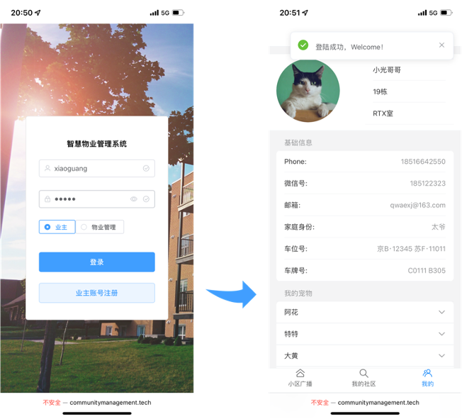

Property managers follow the same login process. As shown in Figure 6.2, property managers use desktop devices to access the system and verify their accounts. After successful authentication, they are directed to the default display page.

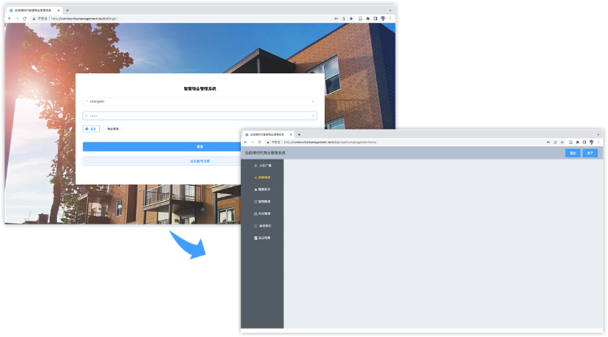

## **Property Owner Registration**
The property owner registration feature includes verification code validation, utilizing the SMS verification service provided by Tencent Cloud. As shown in Figure 6.3, users click the registration button on the login page to access the registration page. First, they need to fill in their personal information and submit it for verification. If the phone number is already registered, they are returned to the input page. If the phone number meets the requirement of not being registered, a verification code is sent. Once the user successfully verifies the code, a registration success message is displayed, and they are redirected to the login page.

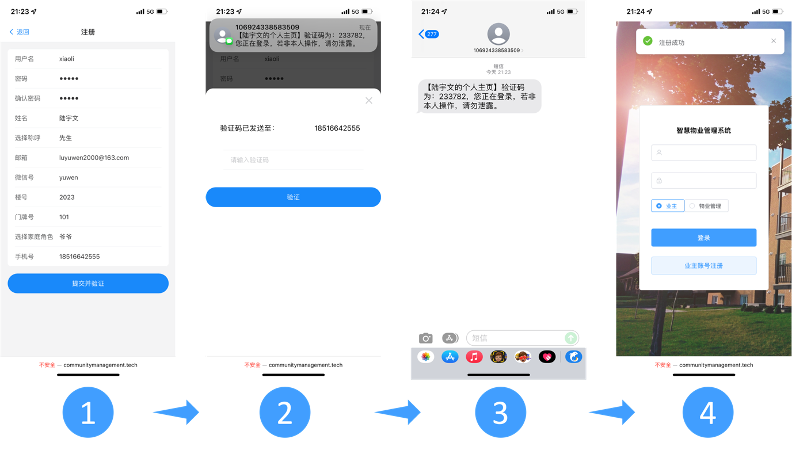

## **Property Owner Profile Modification**
In the "My" page, property owners can modify their personal information. As shown in Figure 6.4, when they select the "Modify Personal Information" button, a pop-up layer for modification is displayed. Users can select the information attribute they want to modify and make the necessary changes.

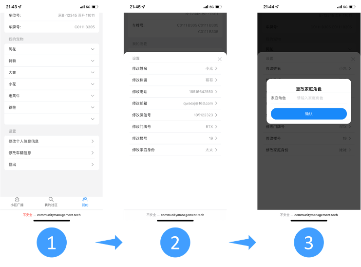

## **Maintenance and Repair Functionality**
The maintenance and repair functionality involves strong interaction between property owners and property managers. As shown in Figure 6.5, property managers can access the "Maintenance and Repair" page to query maintenance work orders. The work order includes information such as the contact details of the reporter, repair location, and repair type. In Figure 6.6, property managers can edit the progress of the work order, add repair personnel, and set the repair status.

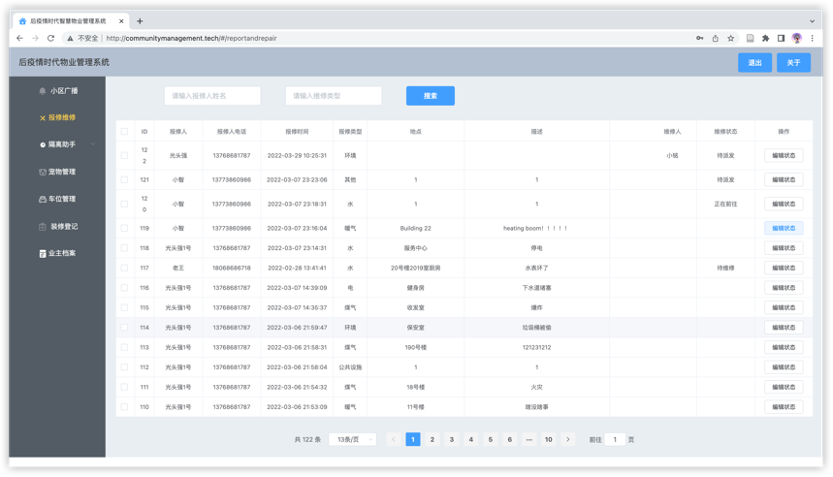

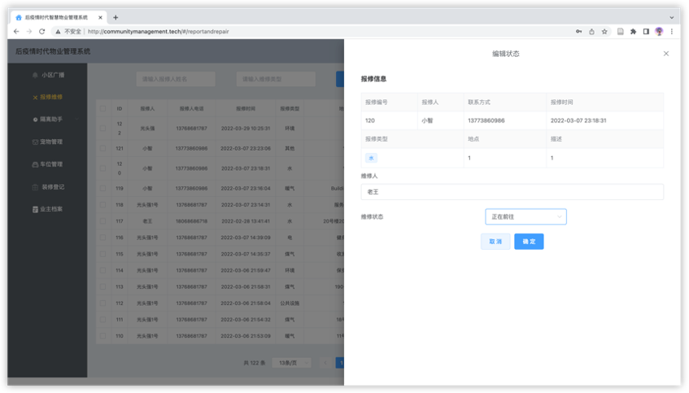

## **Display of Maintenance and Repair Work Orders**

1.1 The property owners have the functionality to create and query maintenance work orders. As shown in Figure 6.7, when creating a work order, users need to input their personal information and repair details. The query functionality allows property owners to view their historical work orders and check the progress.

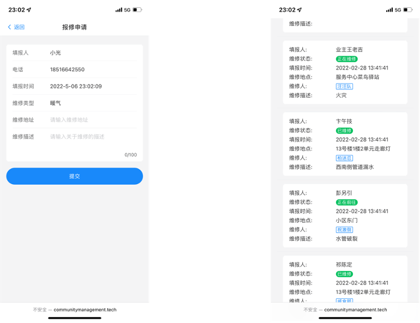

## **Express Delivery Proxy Functionality**

Similar to the maintenance and repair module, the express delivery proxy functionality allows property managers to search and edit the progress of entrusted deliveries. As shown in Figure 6.8, property managers can query pending orders and view the related delivery information. Additionally, as shown in Figure 6.9, property managers can edit the delivery status.

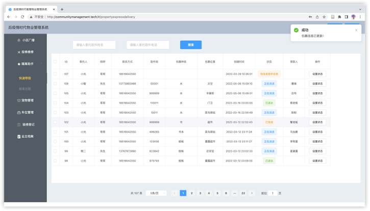

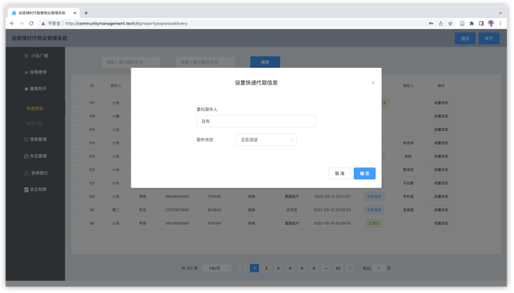

For property owners, they have the functionality to submit express delivery proxy orders and query the latest progress, as shown in Figure 6.10.

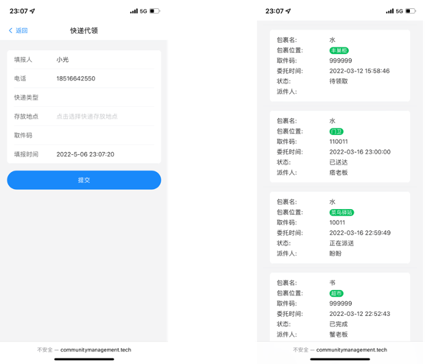

## **Community Broadcasting Functionality**

In the community broadcasting functionality, property owners can add and delete broadcast content. After editing, the content can be previewed on the right side of the screen, as shown in Figure 6.11.

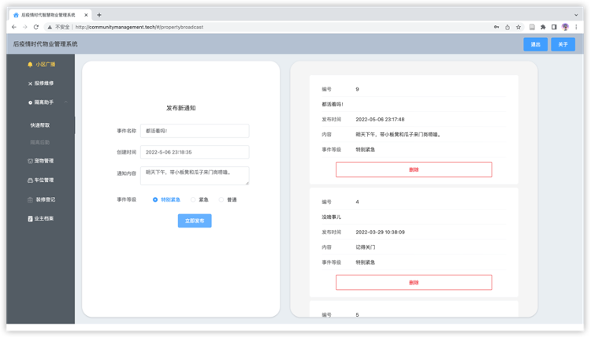

In the bottom bar of the property owner's interface, the "Community Broadcasting" section provides access to the latest community notifications, as shown in Figure 6.12.

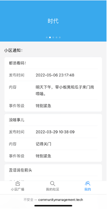

## **Pet Management Functionality**

Property managers can query pet information and use fuzzy search to obtain owner information and contact details, as shown in Figure 6.13.

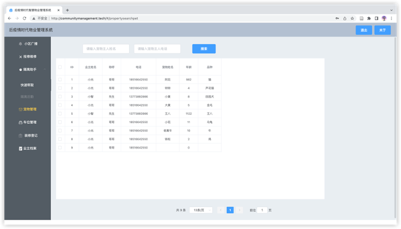

Property owners can register pets in the "My Community" section by providing relevant information, as well as modify existing pet information in the personal information page, as shown in Figure 6.14.

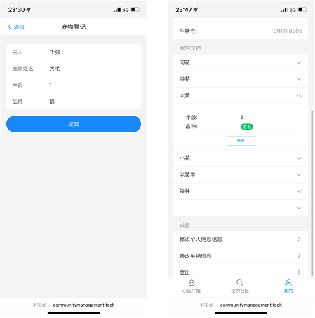

## **Vehicle Management Functionality**

Property managers can query registered vehicles within the community and use fuzzy search to obtain owner information, as shown in Figure 6.15.

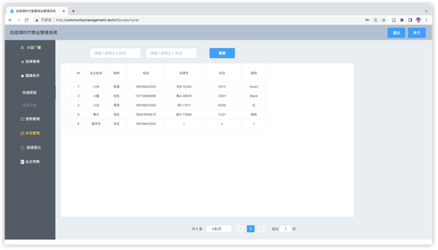

Property owners can register vehicles in the "My Community" section by providing relevant information, as shown in Figure 6.16.

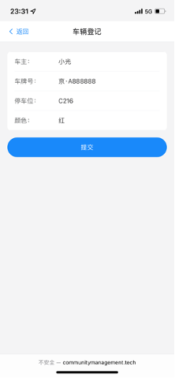

## **Renovation Management Functionality**

Property managers can use the renovation management functionality to query renovation plans within the community, as shown in Figure 6.17. Similarly, the query functionality also supports fuzzy search, making it convenient for property managers to work. By clicking the "View" button, property managers can access detailed renovation plans, including information such as renovation time and construction team.

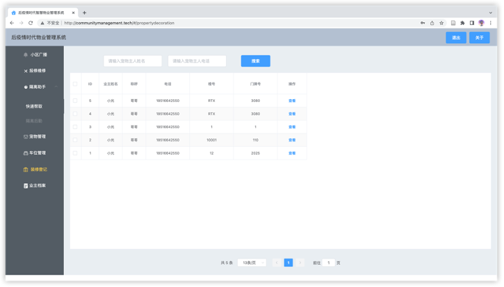

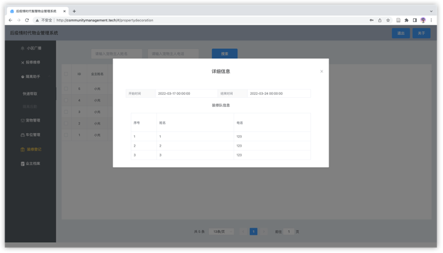

Property owners can enter their own renovation plans in the "My Community" section, where they need to input information such as the start time, end time, and construction team, as shown in Figure 6.19.

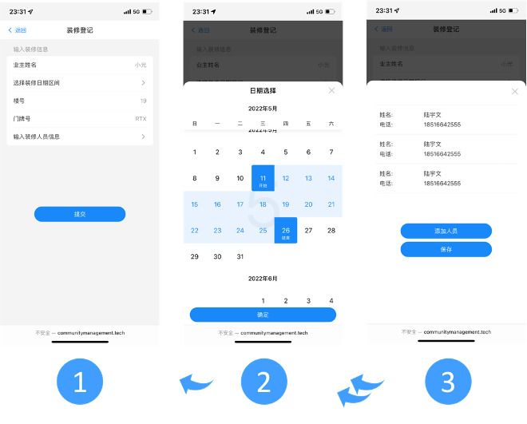

# **System Testing and Deployment**
## **System Testing**
### **Interface Testing**
As shown in Figure 7.1 and Figure 7.2, the Smart Property Management System mainly uses Swagger and Postman for interface testing, with most of the interface testing done in Swagger. With project configuration, the Swagger tool provides a clear list of project interfaces, automatically generating the project interface documentation, making it easy to operate. However, when the system encounters bugs, it is often difficult to find the exact cause of the error from Swagger alone. In such cases, Postman is used as an auxiliary tool. Postman, as a well-known interface testing software, provides comprehensive functionality. During the development of the Smart Property Management System, Postman was relied upon to solve many problems.

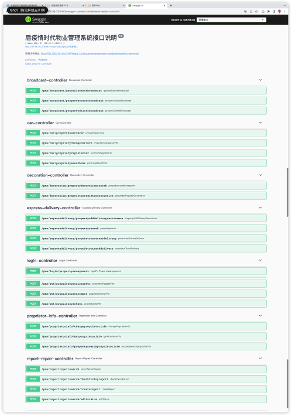

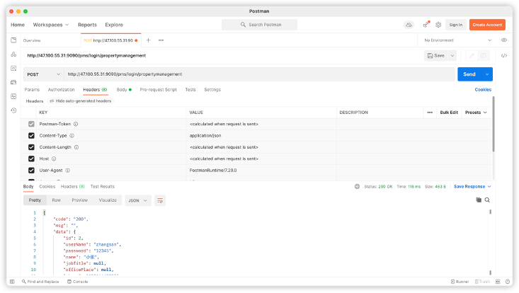
### **Performance Testing**
After the deployment, the property management system underwent performance testing using the Alibaba Cloud Performance Testing Service (PTS).

The following data shows the load configuration. In the performance testing scenario, 10 serial business operations from the Smart Property Management System were added, with increasing concurrency level in each step for a total of 5 minutes. The concurrency level was set to 50, resulting in a total of 68,000 requests, as shown in Figure 7.3. Out of the total requests, 1,133 requests were exceptional, resulting in an overall success rate of 98.34%. The stress test results were satisfactory, demonstrating a certain level of robustness.

**Table 7.1 Load Testing Configuration**

| Load Testing Duration: 5 minutes                               |
| Start Time: 2022-05-01 23:46:20                                |
| End Time: 2022-05-01 23:51:19                                  |
| Concurrent Users (Peak/Limit): 50/50                            |
| RPS (Peak/Limit): 259/4000                                     |
| Total Traffic (Request/Response): 8.64MB / 28.24MB             |
| Traffic (Average/Peak): 125.89KB/s / 287.51KB/s                |
| Sent Traffic (Average/Peak): 29.60KB/s / 34.12KB/s             |
| Received Traffic (Average/Peak): 96.71KB/s / 253.39KB/s        |

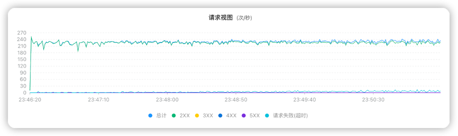

Figure 7.4 shows the request statistics from the test results. It can be seen that when the concurrency level is low, the number of failed requests is almost zero. As the load increases, the number of failed requests gradually increases but remains at a very low frequency. In most cases, the request results are ideal, demonstrating excellent performance overall.

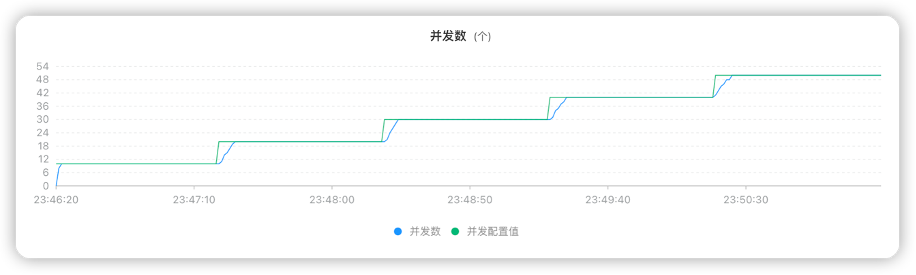

Figure 7.5 shows the concurrency configuration for the performance testing, with the highest concurrency level set to 50 and starting from 10, increasing by 10 every 1 minute for a total of 5 minutes.

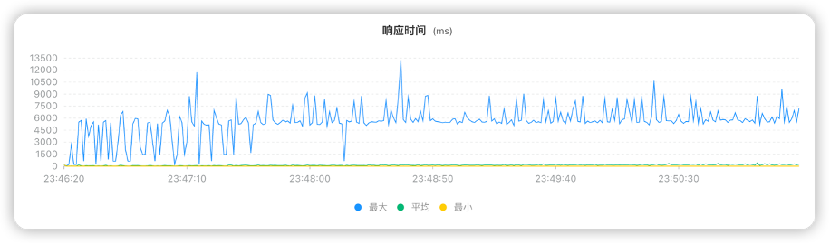

Figure 7.6 shows the response time results. The system demonstrates excellent response speed. In the first 2 minutes, the average response time is less than 100 milliseconds, around 70 on average. Starting from the third minute, as the concurrency level increases, the average response time gradually rises to around 150 milliseconds. Although there are peak values where the average response time reaches 300 milliseconds, it quickly stabilizes around 150 milliseconds. The maximum response time reaches 1.3 seconds, and the minimum is 3 milliseconds. However, these extreme values do not provide meaningful reference.

Overall, the stress test results were satisfactory. The reasons for obtaining such results are as follows:

1. The system is deployed on Alibaba Cloud servers, and the performance testing tool is also provided by Alibaba Cloud. Therefore, the access speed between the testing tool and the server is very fast, as the route between the Smart Property Management System server and the performance testing tool is only one hop.

2. The Smart Property Management System does not have complex business logic and has a simple workflow, resulting in high efficiency of backend operations.

3. In the performance testing, considering the hardware configuration of the server, a very high concurrency level was not set.

## **System Deployment**
### **Deployment Design**
The Smart Property Management System was initially deployed on an Alibaba Cloud Elastic Compute Service (ECS) instance with a 1-core CPU and 2GB RAM. As shown in Figure 7.7, this configuration currently meets the requirements for running the system.

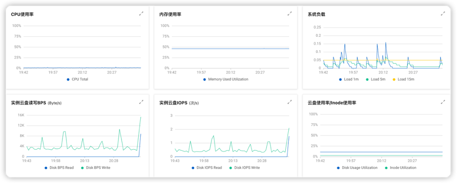

In the deployment plan, the backend JAR package is configured to run in Docker, while the frontend runs in Nginx, as shown in Figure 7.8.

### **Domain Name Registration**
The Smart Property Management System applied for a domain name, "communitymanagement.tech." The domain name registration was entrusted to Yantai Dithipu Network Technology Co., Ltd. on the Tencent Cloud platform. The domain name is currently valid until March 28, 2023. Figure 7.9 shows the domain name certificate.

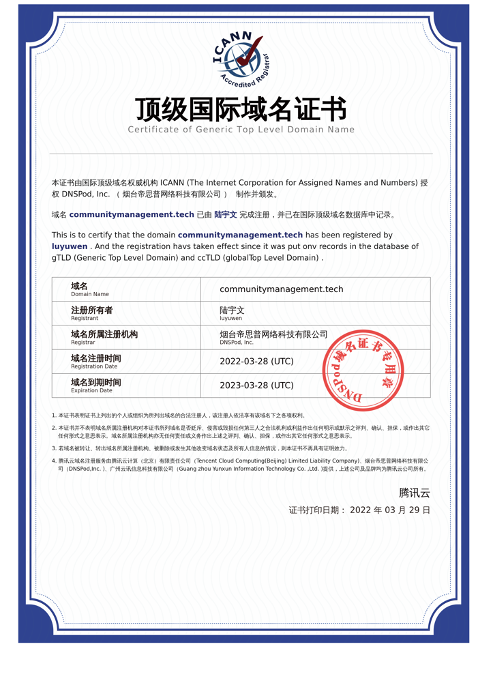

### **System Filing**
After the development work was completed, the website underwent the public security filing. The website filing number is "苏ICP备2022015630号" (Jiangsu ICP Record No. 2022015630). Figure 7.10 shows the email confirmation for the successful filing, and Figure 7.11 shows the record information on the Ministry of Industry and Information Technology's official website.

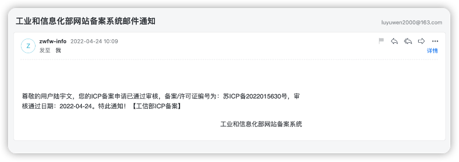

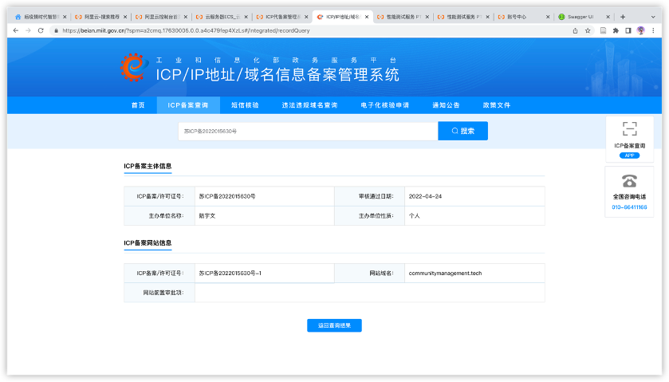

# **Conclusion and Outlook**
## **Conclusion**
The design and development of the Smart Property Management System went through feasibility analysis, requirements analysis, overall design, detailed system design, testing, and deployment stages. It implemented a front-end and back-end separated project using Spring Boot and Vue, embodying the knowledge and skills acquired in courses such as Java programming, software engineering, software testing, computer networks, data structures and algorithms, and intelligent interaction technology as part of the undergraduate curriculum. The graduation project was completed on schedule.

## **Outlook**
From the perspective of system architecture, the design and implementation of the Smart Property Management System are reasonable and advanced, allowing it to operate independently and meet the requirements for deployment.

However, due to limitations in work efforts and the current level of development, no further development and optimization were conducted on the system, especially in areas such as concurrent processing, system security, and UI optimization.
